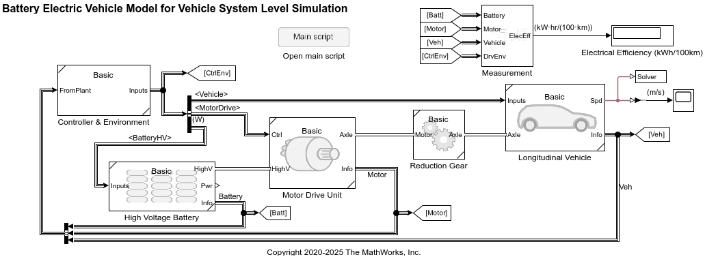
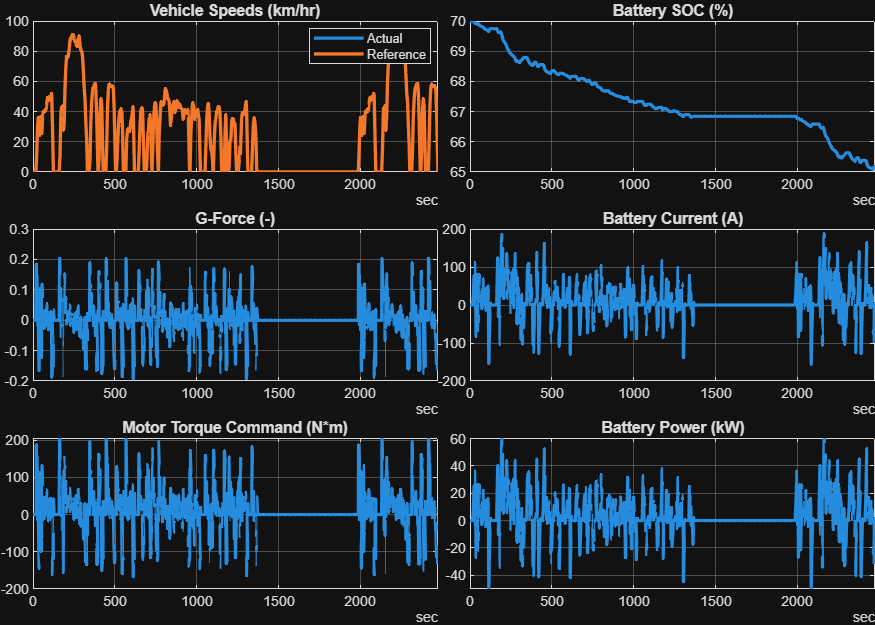
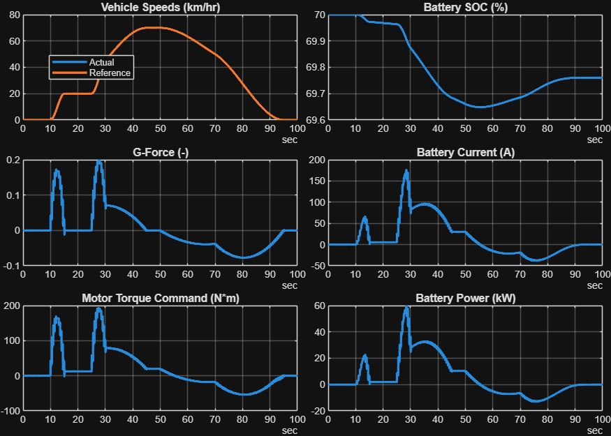
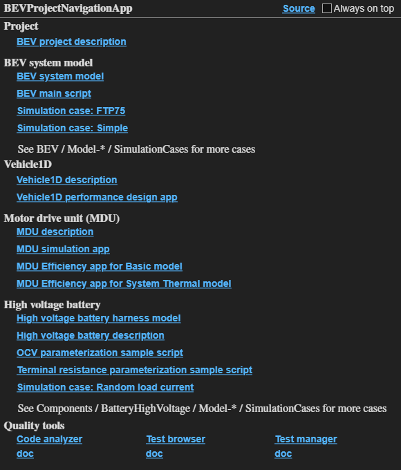
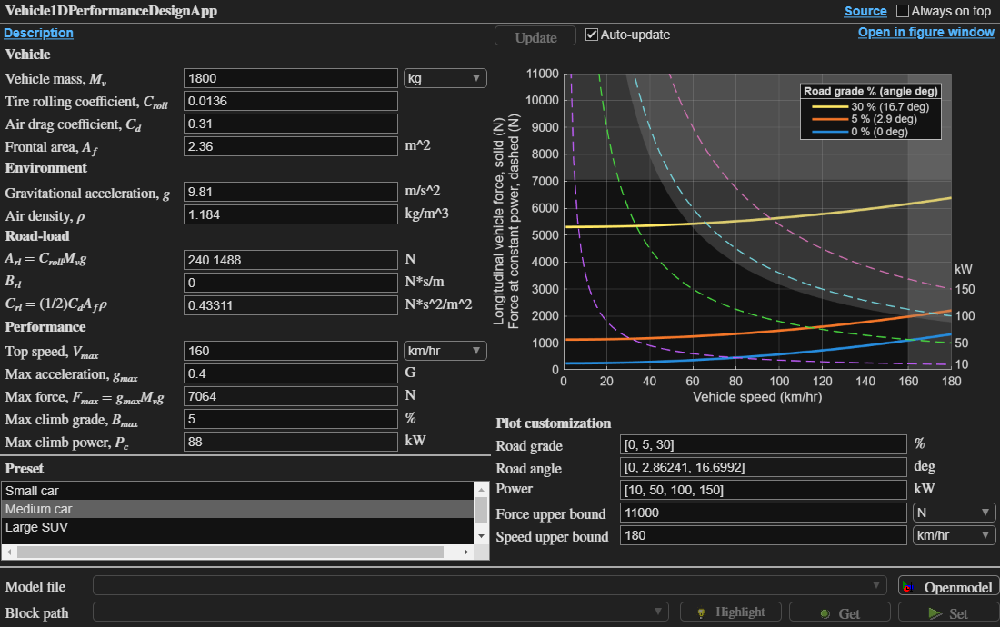
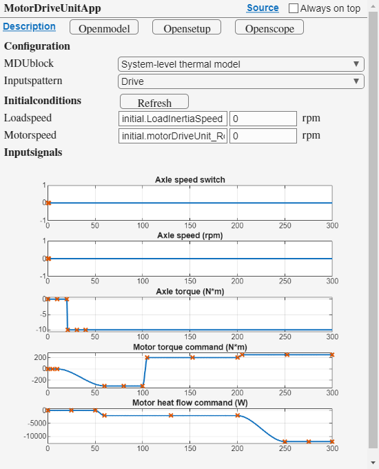
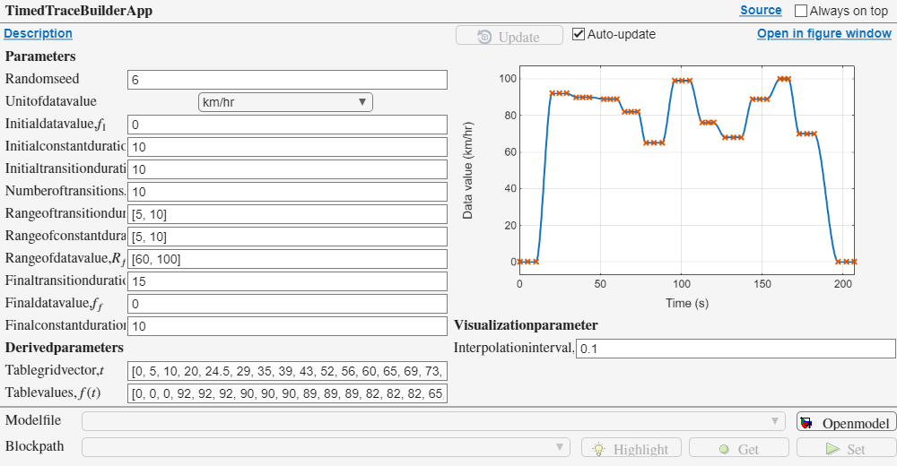
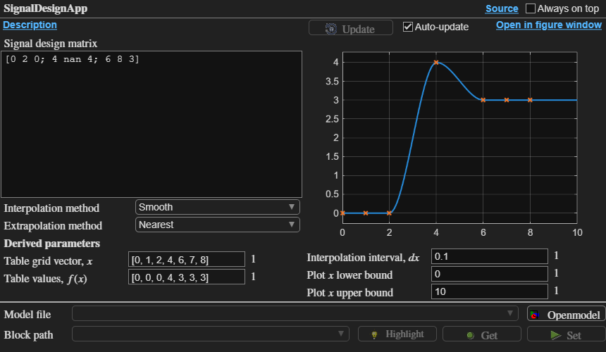

# Battery Electric Vehicle Model in Simscape&trade;

[![View Battery Electric Vehicle Model in Simscape on File Exchange][url-fx-icon]][url-fx-bev]

Version 3.1

[url-fx-bev]: https://www.mathworks.com/matlabcentral/fileexchange/82250
[url-fx-icon]: https://www.mathworks.com/matlabcentral/images/matlab-file-exchange.svg

## Introduction

This is a MATLAB&reg; Project containing
a [Battery Electric Vehicle (BEV) model](BEV/README.md) and
its components such as
motor, high voltage battery, and longitudinal vehicle.
This project demonstrates Simscape's modular and
multi-fidelity modeling technology.

The abstract BEV model is built in a simple and modular fashion,
and it can run faster than real-time.
It is suitable as a baseline model for drive cycle simulation
to estimate vehicle's electrical efficiency and
other vehicle-level information.

This project also contains the model of a detailed
permanent magnet synchronous motor (PMSM) and controller.
It captures the detailed behaviors of the AC motor drive unit
and can estimate the electrical efficiency at the unit level.

A Live Script demonstrates how to obtain the electrical efficiency
from the slow but detailed motor drive unit and use the result
as the block parameter of the simple but fast motor drive block
in the BEV model.

BEV system model:

FTP75 drive cycle simulation result:

Simple drive pattern simulation result:

Use **BEV Project Navigator App** to quickly access some key files and tools.

Use **Vehicle1D Performance Design App** to design the basic performance parameters
of a road vehicle.

Use **Motor Drive Unit Efficiency App for System Thermal Model** to understand
how the model parameters are affecting the motor efficiency.

Use **Motor Drive Unit Simulation App** to select model and run simulation for
the Motor Drive Unit.

## What's New in 3.1 (August 2025)

Improved signal design for lookup table blocks

- Smooth signals (a.k.a. Akima spline) and piece-wise linear signals
  for lookup table blocks are now designed with the Signal Tool,
  which is stored in the Project root > Utility > SignalTool.
- The Signal Tool provides MATLAB functions and Apps for designing signal traces.
  The tool works with Simscape PS Lookup Table (1D) blocks and
  Simulink 1-D Lookup Table blocks.
- The Signal Tool has replaced the Signal Designer.
  The Signal Designer provided Simulink custom block library for designing and using
  smooth or linear signals.
  With the Signal Tool, signal design process is isolated from signal usage process.
  Models containing lookup tables do not depend on the Signal Tool.
- Timed Trace Builder App is added to the project.
  The app is a uifigure-based app built with the Signal Tool.
  The app is used to design timed signal traces with high-level properties.
  Generated data are used in some lookup tables as simulation inputs.
  

Streamlined model set up

- Selecting a referenced subsystem is done by clicking a button
  placed right next to the Subsystem Reference block.
- Custom functions to change a referenced subsystem have been removed.
- The Inputs blocks in harness models are now Referenced Subsystems.
  Some smooth signal traces in the Inputs are now designed by the Signal Tool.

Improved isolation of simulation case scripts

- Simulation case scripts directly use the product API as much as possible.
  The simulation case scripts for the same model do very similar operations
  that were used to be managed by custom functions to avoid writing similar code
  in multiple places.
  However, the use of custom functions was making the comprehension
  and modifications of the scripts hard.
  The scripts are now more isolated from each other and easier to figure out
  how to modify individually.

Improved discoverability and organization of test files

- Test files are stored in the same folder with their targets.
- Test files are named as `unittest_*`, `uitest_*`, `uptodatetest_*`, or
  `uiuptodatetest_*` so that the purpose of each test file is clear from its file name.
- Separating test files by their purpose makes it easy to run related tests only.

Better organization of utility tools

- Utility tools are now organized into separate name spaces based on their functionality.
  See the folders in the Project root > Utility.

## Whats' New in 3.0 (July 2025)

Past What's New contents have been moved to [Change Log](ChangeLog.md).

### Plain-text Live Scripts

From R2025a, you can save Live Scripts as plain-text files.

- MATLAB: [Live Code File Format (.m)][doc-m-live-script]

All Live Scripts in the project are now plain-text with `.m` extensions.
The use of plain-text files improves the compatibility with source control systems.
Text-based search and replace work with not only conventional MATLAB code files but
also all Live Script files in the project.

[doc-m-live-script]: https://www.mathworks.com/help/matlab/matlab_prog/plain-text-file-format-for-live-scripts.html

### Revamped Component Folders

A model for testing a component is now placed in the component top folder.
This improves the discoverability of models for component testing.

Component models that are built as Referenced Subsystems such as Basic model or System model
are stored in separate subfolders, such as Model-Basic or Model-System, respectively.
Related resources for a referenced subsystem including simulation case scripts and
test code files are saved in the same folder, improving the isolation of each component model.

### Unit testing with Build Tool and `buildfile.m`

For running unit tests,
the project now uses the Build Tool with `buildfile.m`.

- MATLAB: [Overview of MATLAB Build Tool][doc-buildtool]

From R2025a, you can run Build Tool tasks using the Run Build button in the Toolstrips
in addition to using the `buildtool` command on the Command Window.

- MATLAB: [Run Build from Toolstrip][doc-buildtool-toolstrip]

This project has several `buildfile.m` files.
The Editor recognizes the `buildfile.m` file as a Build Tool file
and shows the Run Build button in the Editor Toolstrip.
The project finds the `buildfile.m` file in the project root folder
and shows the Run Build button in the Project Toolstrip.

[doc-buildtool]: https://www.mathworks.com/help/matlab/matlab_prog/overview-of-matlab-build-tool.html
[doc-buildtool-toolstrip]: https://www.mathworks.com/help/matlab/matlab_prog/run-build-from-toolstrip.html

### Updated Reducer Component

Reducer component now has a test model and supporting files.

Also, the Reducer component uses Simscape selective data logging, which
simplifies the way data in Simscape blocks is logged during simulation.
Other components will use the same approach in the future.

- Simscape: [Log Selected Block Variables][doc-simscape-logging-graphical]
- Simscape: [Log Selected Variables Programmatically][doc-simscape-logging-programmatic]

[doc-simscape-logging-graphical]: https://www.mathworks.com/help/simscape/ug/log-individual-block-variables.html
[doc-simscape-logging-programmatic]: https://www.mathworks.com/help/simscape/ug/manage-selective-logging-instrumentation-programmatically.html

#### Signal Design App

To edit physical input signals using PS Lookup Table (1D) blocks
in the Reducer component, Signal Tool is used.

- For graphically editing signals, you can use `SignalDesignApp`
  which is included in the project and you can find in Project root > Utility > SignalTool folder.

  

- For programmatically editing signals, you can use functions in the `SignalTool1` name space.
  See the Live Scripts in Project root > Components > Reducer > Model-Basic > SimulationCases
  folder for example usages.

## Tool Requirements

Supported MATLAB Version:
R2025a or newer releases

Required:
[MATLAB](https://www.mathworks.com/products/matlab.html),
[Simulink&reg;](https://www.mathworks.com/products/simulink.html),
[Powertrain Blockset](https://www.mathworks.com/products/powertrain.html),
[Simscape](https://www.mathworks.com/products/simscape.html),
[Simscape Driveline&trade;](https://www.mathworks.com/products/simscape-driveline.html),
[Simscape Electrical&trade;](https://www.mathworks.com/products/simscape-electrical.html)

Optional:
[MATLAB Test](https://www.mathworks.com/products/matlab-test.html),
[Parallel Computing Toolbox&trade;](https://www.mathworks.com/products/parallel-computing.html)

## How to Use

Open `BatteryElectricVehicle.prj` in MATLAB, and
it will automatically open the project main page `BEV_main_script.html`.
The script contains the description of the model and
hyperlinks to models and scripts.

## How to Use in MATLAB Online

You can try this in [MATLAB Online][url_online].
In MATLAB Online, from the **HOME** tab in the toolstrip,
select **Add-Ons** &gt; **Get Add-Ons**
to open the Add-On Explorer.
Then search for the submission name,
navigate to the submission page,
click **Add** button, and select **Save to MATLAB Drive**.

[url_online]: https://www.mathworks.com/products/matlab-online.html

## Testing and quality assurance

BEV system model and its components are tested using [MATLAB Unit Testing framework][doc-test].

- Some tests are _passing tests_ that check if code runs or not and
  do not use the `verify*` functions.
  They simply run scripts, functions, classes,
  or models, and check that they run without errors.
  Passing tests are designed to finish quickly so that they can be used
  in day-to-day development activities in a short iteration cycle.

- This project uses the [buildtool][doc-buildtool] with `buildfile.m` to
  check code, run tests, measure code coverage, and generate test reports and
  code coverage reports.
  See `buildfile.m` in this project for how the buildtool is configured.
  Checking code with the buildtool is done by [Code Analyzer][doc-codeissues].

[doc-test]: https://www.mathworks.com/help/matlab/matlab_prog/class-based-unit-tests.html
[doc-buildtool]: https://www.mathworks.com/help/matlab/ref/buildtool.html
[doc-codeissues]: https://www.mathworks.com/help/matlab/ref/matlab.buildtool.tasks.codeissuestask-class.html

## Remote test automation / Continuous integration

[The git repository of this project in github.com/mathworks][url-gh-bev] is set up for
test automation using [GitHub Actions][doc-github-actions] and [MATLAB Actions][doc-mlactions].
Unit tests in this project are run automatically
when changes are pushed to the repository in github.
See the [`.github/workflows` folder](.github/workflows) for configuration files.

[doc-github-actions]: https://docs.github.com/en/actions
[doc-mlactions]: https://github.com/matlab-actions
[url-gh-bev]: https://github.com/mathworks/Simscape-Battery-Electric-Vehicle-Model

## Additional Notes

- [Using MATLAB Project](docs/Using-MATLAB-Project.md)

- [MATLAB Testing Framework](docs/MATLAB-Testing-Framework.md)

## See Also

### MATLAB Central File Exchange

Visit the File Exchange page of this project.

- https://www.mathworks.com/matlabcentral/fileexchange/82250

Hybrid Electric Vehicle Model in Simscape

- Provides an abstract power-split HEV model.
  The level of abstraction is similar to this project.
- https://www.mathworks.com/matlabcentral/fileexchange/92820

Electric Vehicle Design with Simscape

- Provides BEV design workflows using detailed models
  for detailed analysis.
- https://www.mathworks.com/matlabcentral/fileexchange/124795

## License

See [`license.txt`](license.txt).

_Copyright 2020-2025 The MathWorks, Inc._
