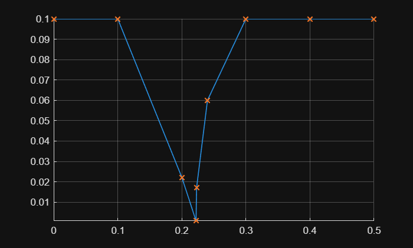
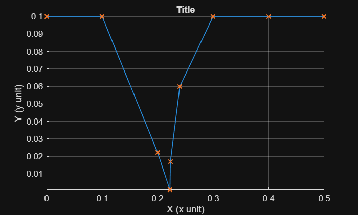
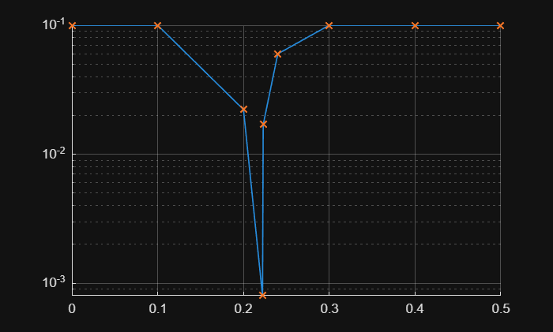

# <span style="color:rgb(213,80,0)">plotDifference sample script</span>

Just run the function without any arguments to see an example plot.

```matlab
SignalTool2.plotDifference
```

<center></center>


Usually, you pass data to the function.

```matlab
data = [0, 0.1, 0.2, 0.2222, 0.223, 0.24, 0.3, 0.4, 0.5];
SignalTool2.plotDifference(data, Title="Title", XLabel="X", XUnitText="x unit", YLabel="Y", YUnitText="y unit")
```

<center></center>


Use log scale in Y axis.

```matlab
SignalTool2.plotDifference(data, YScale="Log")
```

<center></center>


*Copyright 2025 The MathWorks, Inc.*

