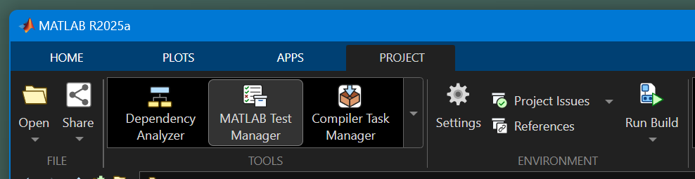
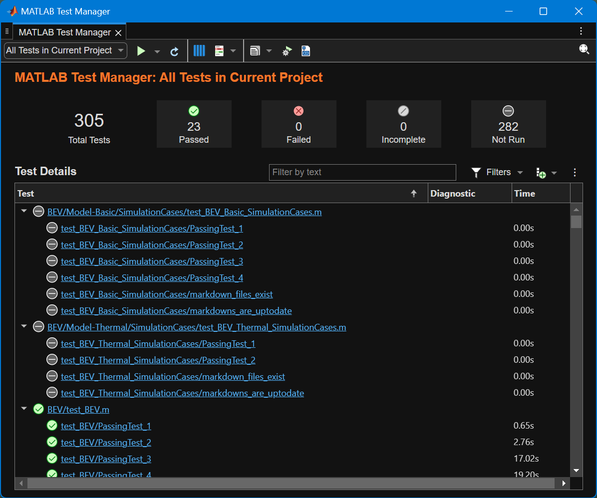
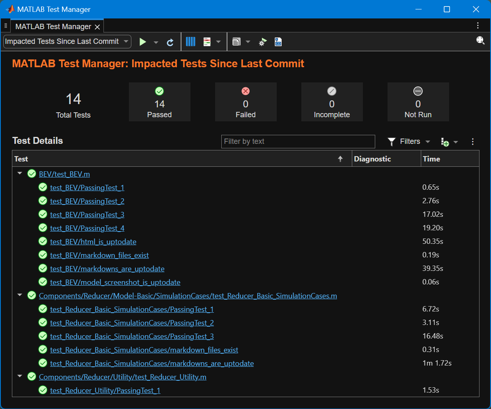

# MATLAB Testing Framework

## Interactive or programmatic testing in MATLAB

This project includes tests which check that
models and scripts run without errors and warnings.
The main product feature used for testing is
[MATLAB Testing Frameworks][url-test].
Specifically, [class-based unit test][url-classbased] is implemented
for each component, BEV system model, and the project.

[url-test]: https://mathworks.com/help/matlab/matlab-unit-test-framework.html
[url-classbased]: https://mathworks.com/help/matlab/class-based-unit-tests.html

### Test Browser

You can run tests interactively in MATLAB Editor.
Open [Test Browser][url-testbrowser] (the `testBrowser` command)
to see pass/fail status of the tests as you run tests.
Test Browser also lets you measure code coverage.

[url-testbrowser]: https://www.mathworks.com/help/matlab/ref/testbrowser-app.html

### MATLAB Test Manager

For MATLAB projects, you can also use
[MATLAB Test Manager][url-testmanager] to run tests and measure code coverage.
It requires the MATLAB Test license.
MATLAB Test Manager can find test files in the project
and lets you run them all at once or individually.

[url-testmanager]: https://www.mathworks.com/help/matlab-test/ref/matlabtestmanager-app.html

You can open MATLAB Test Manager from the Project toolstrip or
with the `matlabTestManager` command.

MATLAB Test Manager finds the tests in the project and shows the status.
By default, MATLAB Test Manager selects "All Tests in Current Project" in
the drop down near the top left of the window.

Select "Impacted Tests Since Last Commit" from the drop down and
MATLAB Test Manager updates the list to show tests that are impacted by
the changes you have made after the last commit.

### Build Tool with `buildfile.m`

You can run tests programmatically or interactively.
To run tests programmatically, use the `buildtool` command
provided by the [MATLAB Build Tool][url-buildtool].
To run tests interactively, open the `buildfile.m` file in MATLAB Editor
and use the Run Build button in the Editor toolstrip.
The Project toolstrip also has a Run Build button which is linked to
the `buildfile.m` file in the project root folder.
MATLAB Build Tool supports not only unit test,
but also code coverage measurement,
code issues checking, custom tasks,
building task dependencies, and more.

[url-buildtool]: https://mathworks.com/help/matlab/matlab_prog/overview-of-matlab-build-tool.html

### Code Analyzer

[Code Analyzer app][url-analyzer] (the `codeAnalyzer` command) can identify issues in the code files.

Code Analyzer is integrated with Build Tool
as [CodeIssuesTask][url-codeissuestask].

[url-analyzer]: https://mathworks.com/help/matlab/ref/codeanalyzer-app.html
[url-codeissuestask]: https://www.mathworks.com/help/matlab/ref/matlab.buildtool.tasks.codeissuestask-class.html

## Notes about file name and unit test

If the name of a `.m` script file starts or ends with `test` in case-insensitive manner,
such as `testModel1.m` or `myScript2Test.m`,
MATLAB including the Build Tool treats it as a unit test file.
This is part of the [script-based unit test][doc-script-test] feature, and
such files are automatically run when you run the build tool.

[doc-script-test]: https://www.mathworks.com/help/matlab/matlab_prog/write-script-based-unit-tests.html

## Automated testing in continuous integration

Test files introduced above can be used locally in your machine
where you run a test runner script in MATLAB.
If you also have a remote repository server for source control
(such as GitHub or GitLab),
you can use the same test files to automatically test
the project when you push local changes to the remote.

If your repository is a public repository in github.com,
you can use MATLAB and some toolboxes for free
in GitHub Actions Continuous Integration service.
There are limits on execution time and resources imposed
by GitHub Actions.
For more information, see the documentation linked below.

- [Continuous Integration (CI)][url-ci]
- [GitHub Actions][url-gh-actions] (github.com)
- [MATLAB Actions][url-ml-actions] (github.com)

[url-ci]: https://mathworks.com/help/matlab/continuous-integration.html
[url-gh-actions]: https://docs.github.com/en/actions
[url-ml-actions]: https://github.com/matlab-actions/overview

To learn more about Continuous Integration with MATLAB,
see the following resources:

- [Continuous Integration (CI) configuration examples for MATLAB][url-ci-examples]
  (github.com)
- [Advanced Continuous Integration (CI) configuration examples for MATLAB][url-ci-advanced]
  (github.com)

[url-ci-examples]: https://github.com/mathworks/ci-configuration-examples
[url-ci-advanced]: https://github.com/mathworks/advanced-ci-configuration-examples

_Copyright 2023-2025 The MathWorks, Inc._
